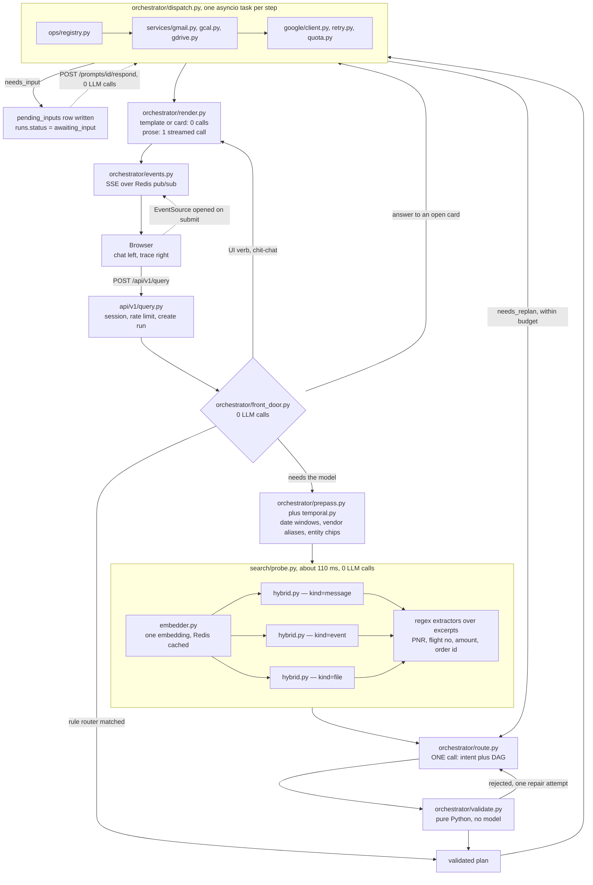
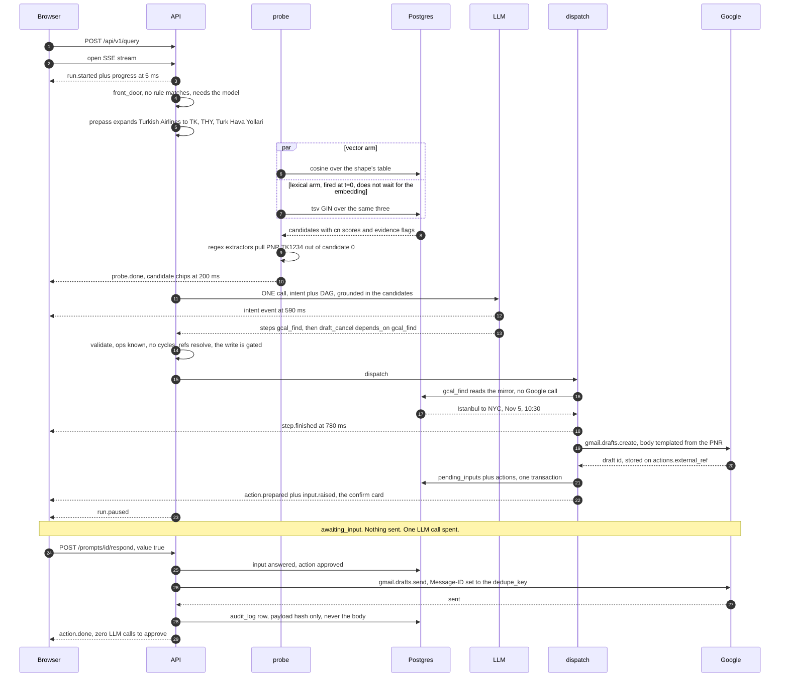
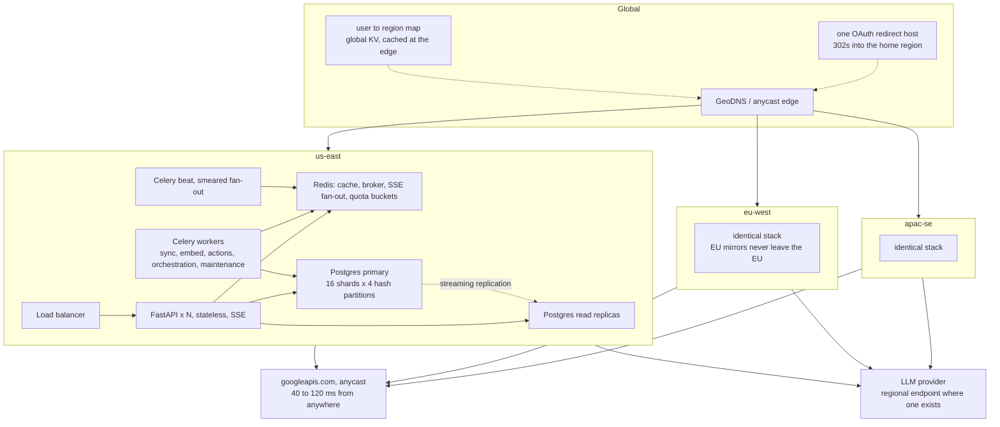

# Design

How the orchestrator is put together, why the central decision went the way it did, and what
happens to all of it at a million users.

Read `docs/schema.md` for the tables and `docs/contracts.md` for the module boundaries. This
document assumes both.

---

## 1. Architecture

### The five stages the brief names, and where each one lives

The brief draws five boxes. Here is the module that implements each, and what it costs.

| Brief stage | Module | LLM calls |
|---|---|---|
| **Intent Classifier** | `orchestrator/front_door.py` resolves what it can with rules; anything left goes to `orchestrator/route.py`, whose single call returns the intent object. Stored on `runs.intent`. | 0 or shares the one below |
| **Query Planner** | `orchestrator/route.py` — the same call, same response. `orchestrator/validate.py` then checks the DAG in pure Python. Stored as `node_executions` rows. | 1 (shared) |
| **Service Orchestrator** | `orchestrator/dispatch.py` over `ops/registry.py`, calling `services/gmail.py · gcal.py · gdrive.py` through `google/client.py`, `retry.py`, `quota.py`. One asyncio task per step. | 0 |
| **Embedding & Search** | `search/embedder.py`, `chunking.py`, `hybrid.py`, `probe.py`, over the `sync_*` tables in pgvector. | 0 completions, 1 embedding |
| **Response Synthesizer** | `orchestrator/render.py` — a template or a card at 0 calls, or one streamed prose call. | 0 or 1 |

One deliberate merge. The brief draws Intent Classifier and Query Planner as two boxes, and
two boxes read naturally as two calls — but the second call's input is almost entirely the
first call's output, so you would be paying a round trip to hand the model back what it just
said. We emit both halves from one structured response:

```json
{"type": "plan",
 "intent": {"name": "cancel_flight", "services": ["gmail", "gcal"], "has_write": true, "confidence": 0.91},
 "answer_style": "card",
 "steps": [ ... ]}
```

The two boxes still exist as separable artifacts — `runs.intent` holds the classifier half,
`node_executions` holds the planner half, and `validate.py` can reject a plan whose steps
contradict its declared intent. What we do not do is pay twice for one thought.

### The request path



### One query, end to end, with clocks on it

"Cancel my Turkish Airlines flight."



### The LLM budget

Embeddings are not counted here — they are a different API, roughly a thousandth of the cost,
and they are cached by content fingerprint.

| Class | Front door | Plan | Extract | Render | Calls |
|---|---|---|---|---|---|
| Answer to an open card, "send it", "not now" | resolves | — | — | — | **0** |
| UI verb, "show more", "open that" | resolves | — | — | — | **0** |
| Chit-chat | resolves | — | — | — | **0** |
| Rule-routed read, "what's on my calendar next week" | routes | — | — | template | **0** |
| Template read | — | 1 | — | template | **1** |
| Prose read | — | 1 | — | 1 | **2** |
| Write prepare, extractor hit | — | 1 | — | card | **1** |
| Write prepare, extractor missed | — | 1 | 1 | card | **2** |
| Ambiguous, then resumed | — | 1 | — | card | **1** |
| One replan | — | 1 | +1 | 1 | **3** |
| Hard cap, `MAX_LLM_CALLS_PER_RUN` | | | | | **5** |

Mean across a realistic mix: about **1.9 calls per completed task**. The cheap rows are not
decoration — every turn the front door absorbs at 0 calls is a turn that never touches a
provider rate limit, which is the thing that breaks first at scale (§3.7).

### Retrieval, in one paragraph

`hybrid.py` runs a metadata prefilter (always including `user_id`), then a vector cosine arm
and a Postgres full-text arm in parallel, and fuses them with RRF at k=60 **for ordering
only**. Ranking and deciding are separated on purpose. Decisions — is this good enough to
show, are the top two too close to call, is this good enough to write against — are made on
`cn`: cosine normalised per corpus, z-scored, clamped to 0..1, alongside an `evidence` flag
set by an exact match on id, sender, filename, or an alias token in the subject. RRF is
rank-derived; a fused score of 0.0163 means "it came first", not "it is right", and it cannot
tell a perfect match from the best of a bad lot. Scoring then applies temporal decay,
`score * exp(-age_days / 30)` for mail, and a forward boost for future events.

`FLOOR_READ = 0.55`, `MARGIN = 0.15`, `FLOOR_WRITE = 0.80`. Hand-set from staring at the
evaluation set, not calibrated. §9 says what we would do about that.

---

## 2. Why a grounded DAG and not a tool loop

This is the decision the rest of the system hangs off, so it gets the honest version.

### The comparison, on the same query

Take "Cancel my Turkish Airlines flight", with the probe's candidates available to both
designs.

**Tool loop.** Turn 1: the model reads the candidates already in its prompt, emits a parallel
tool call for the calendar lookup and a `draft_email` with the PNR typed inline. Turn 2: the
model writes the answer, or we render the card from the tool result. **One to two calls.**

**Our DAG.** Probe extracts the PNR by regex at 0 calls. One planner call returns the intent
and three steps, with the draft's body templated as
`{{search.gmail[0].extracted.pnr}}`. Dispatch: 0 calls. The confirm card renders from
`Op.preview()`: 0 calls. **One call.**

They are the same. The loop is not paying for `llm.extract` because the model already has the
email text in context and simply types the reference; it is not paying for reference
templating because there is nothing to template. On the branch where our regex misses, the
loop is **cheaper by one call** — we spend `llm.extract`, it spends nothing. That is a real
concession and it is worth stating before the advantages, because a comparison that only
lists your own wins is not a comparison.

### Where the DAG genuinely wins

**Declared parallelism.** `depends_on` is in the plan before anything runs, so `dispatch.py`
starts one asyncio task per step and each awaits only its own dependencies and the per-service
semaphore. A loop discovers parallelism only when the model happens to emit several tool calls
in one turn, and it can never parallelise *across* turns, because turn N+1 does not exist
until turn N has returned. "Prepare for tomorrow's meeting with Acme Corp" touches Calendar,
Gmail and Drive; the DAG runs all three concurrently by construction. The loop does it if the
model felt like it.

**Bounded cost.** The DAG's LLM spend is known before execution: one planner call, at most
`defer.budget` replans, at most one render call, hard cap five. A loop's cost is a function of
the model's judgement and the tail is where the money is. A loop that takes eight turns on a
bad day costs eight times, and there is no natural place to cut it off that is not arbitrary.

**Testability.** A plan is a JSON document, so you can assert on it without running anything
irreversible. `test_prepare_meeting_fans_out_three_ways` reads `depends_on` and asserts the
three search steps have no edges between them. `validate.py` rejects unknown ops, dangling
references, cycles, a write step with no confirm gate, and args that fail the op's Pydantic
model — all before the first byte leaves the process. There is no equivalent for a loop short
of running the model a few hundred times and squinting.

**Pause and resume cost nothing.** `ask.user` is a step. When it runs, `runs.status` becomes
`awaiting_input` and the plan sits in Postgres. Answering re-enters `dispatch.py` at the same
DAG with one node's result filled in — **zero LLM calls**. A loop resumes by replaying a
transcript through the model, which is one call minimum, on a transcript that has grown.

**The write gate is structural, not a policy.** A write step is a `ConfirmableOp`, so dispatch
writes a `pending_inputs` row and an `actions` row and stops. `actions.requires_input_id` is
`NOT NULL`, so the database refuses to record an ungated write. In a loop the model calls
`send_email` and something outside the model has to intercept it — which works, but the
interception is bolted on rather than being a property of the thing that was planned.

### Where the loop genuinely wins

**No reference templating.** `{{search.gmail[0].extracted.pnr}}` is machinery: a grammar, a
resolver, an error path for a reference that does not resolve, and a `Op.output_fields`
declaration on every op to say what may be referenced. A loop needs none of it. Our reason for
it is that a model retyping a value is a model that can retype it *wrong*, and a wrong booking
reference inside a cancellation email is a bad failure — but that is a trade, not a free win.

**Recovery from surprise.** When step five returns something nobody anticipated, a loop reads
it and adapts on the spot. Our DAG has to notice (`OpResult.needs_replan`), spend a call, and
re-plan, and we cap that at `defer.budget`, so past the cap we hand back to the user.

**Less code.** A tool loop is maybe 150 lines. `route.py` plus `validate.py` plus
`dispatch.py` plus `render.py` is closer to 1,200. Every one of those lines can be wrong.

**It improves for free.** Loops get better when models get better. A DAG's ceiling is partly
set by the plan grammar we designed, and grammars age.

### The decision

**For a long-lived product I would run the loop**, and implement the DAG's guarantees as a
policy layer around it: a validator on every proposed tool call, a confirm gate on writes, a
hard turn cap, and structured logging of the call sequence so you can still assert on
behaviour. The loop's adaptability compounds with every model release; a hand-written grammar
does not.

The DAG is right *here*, for three reasons that are specific to this assignment and would not
survive contact with a two-year roadmap:

1. The brief names a Query Planner that "creates an execution DAG" and lists
   "Sequential dependencies: Extract booking reference → Draft email" as a thing to build. A
   tool loop technically satisfies that and visibly does not demonstrate it. Building the
   thing the brief draws is answering the question, not gold-plating it.
2. The evaluation asks for P99 latency and Precision@5. Both are measurable on a DAG whose
   step count is known in advance. Both are awkward to even define over a loop whose turn
   count varies per query.
3. Six to eight hours. A DAG's failure modes are enumerable and unit-testable in that window.
   A loop's failure modes are behavioural, and you find them by running it a hundred times,
   which is not something you can do in an afternoon on a token budget.

### The probe: search before you plan

A **blind planner** — one that writes a plan before it has seen any of the user's data — has
five strain points:

1. It has to guess whether the thing exists at all. "Cancel my Turkish Airlines flight" with
   no such email in the mailbox produces a confident four-step plan that dies at step one.
2. It has to guess the query string. It writes `search_emails(query="Turkish Airlines flight
   booking")` and hopes, because it cannot see that this mailbox says "THY" in every subject
   line.
3. It has to guess arity. One booking or three? "The flight" and "my flights" are different
   DAGs and it is choosing between them blind.
4. It cannot see ambiguity until execution, so raising an ambiguity card costs a replan, which
   is a second LLM call for something that was knowable before the first one.
5. It has no values, so every downstream argument is a reference to a step that has not run,
   and every one of those is a chance to be wrong.

The probe is one embedding plus three parallel hybrid searches plus regex extractors over the
candidate excerpts. About 110 ms, no LLM call. What the planner receives afterwards is not a
question but a briefing: the top candidates per service with their `cn` scores and evidence
flags, whatever the extractors pulled out of them, the resolved date windows, and the
conversation's entity chips.

That removes four of the five:

- **(1) is answered before planning.** Nothing above `FLOOR_READ` means the plan is
  `{"type": "answer", "text": "I couldn't find ..."}` — one call, no execution, no failed
  steps in the trace.
- **(2) stops being a guess.** The candidates are already found. The planner references them
  by path rather than re-describing them to a search box.
- **(3) is visible.** Two Turkish Airlines bookings are two rows in the briefing.
- **(4) is visible.** Top two inside `MARGIN` means the planner emits `ask.user` as step one,
  instead of discovering the problem at execution time and paying to re-plan around it.
- **(5) remains.** The planner still has to write references correctly. `validate.py` catches
  the syntactically broken ones; the semantically wrong ones execute and fail. That is the
  honest residue.

Probe timing, so the 110 ms is a measurement and not an assertion. The lexical arm needs no
vector, so it fires at t=0 alongside the embedding request rather than after it:

| | Cache miss | Cache hit |
|---|---|---|
| Query embedding, `text-embedding-3-small` | 55 ms | 1 ms |
| Vector arm, 3 HNSW scans in parallel, starts after the embedding | 30 ms | 30 ms |
| Lexical arm, 3 GIN scans in parallel, starts at t=0 | overlapped | overlapped |
| RRF fuse, decay, `cn` normalisation | 5 ms | 5 ms |
| Regex extractors over the excerpts | 2 ms | 2 ms |
| **Total** | **~92 ms** | **~38 ms** |

The probe's cost is that it runs on every query that reaches the model, including the ones
that turn out not to need it. At ~92 ms and about $0.000005 of embedding, that is a good
trade. The one genuine waste is a pure-write query with no retrieval component — "email
bob@x.com saying I'm running late". The rule router catches most of those at the front door;
the ones it misses pay 92 ms.

---

## 3. Scaling to a million users

Working population model, used consistently for every number below:

- **1,000,000 registered.** Mirrors are held for the **400,000** who used the product in the
  last 90 days; the rest keep app data only and resync on return. This is cheap to do
  precisely because `schema.md` says the `sync_` tables are disposable.
- **6 turns per active user per day** → 2.4M runs/day → **28 runs/sec** mean, ~4× at peak.
- A median mailbox: **~120 messages/day**, **15,000 messages** inside the 180-day default
  backfill window, ~1,000 calendar events across a ±180-day span, ~2,000 Drive files.
- **Sustained mirror write rate.** 120 messages a day is ~1.25 new messages per user per
  15-minute cycle, plus ~0.3 calendar and Drive changes: ~1.55 items × 400,000 users =
  **620,000 items per cycle = ~690 upserts/sec** mean, and ~2,700/sec at the working-hours
  peak, since mail does not arrive uniformly around the clock.

### 3.1 Sharding: hash-partition the mirror by `user_id`

Each mirror table becomes `PARTITION BY HASH (user_id)` with 64 partitions, behind a
config flag. Local runs stay unpartitioned — you do not want 64 empty relations on a laptop.

One table instead of three is what makes this cheap: it is one partitioning decision and
one set of indexes to declare, and a new connector inherits both.

```sql
-- SYNC_PARTITIONS: 0 = unpartitioned (local default), 64 = production.

CREATE TABLE sync_messages (   -- and sync_events, sync_files alike
    id               CHAR(21) NOT NULL,
    user_id          CHAR(21) NOT NULL REFERENCES users(id) ON DELETE CASCADE,
    connector        VARCHAR(32) NOT NULL,
    kind             VARCHAR(16) NOT NULL,
    external_id      VARCHAR(255) NOT NULL,
    scope_id         VARCHAR(255) NOT NULL DEFAULT '',
    chunk_index      SMALLINT NOT NULL DEFAULT 0,
    -- ... every other column exactly as docs/schema.md declares it ...
    PRIMARY KEY (user_id, id),                       -- the one real change
    UNIQUE (user_id, connector, scope_id, external_id, chunk_index)  -- already partition-key-first
) PARTITION BY HASH (user_id);

DO $$
BEGIN
  FOR i IN 0..63 LOOP
    EXECUTE format(
      'CREATE TABLE sync_messages_p%s PARTITION OF sync_messages '
      'FOR VALUES WITH (MODULUS 64, REMAINDER %s)', i, i);
  END LOOP;
END $$;

-- Declared once on the parent; Postgres builds one per partition.
CREATE INDEX ON sync_messages USING hnsw (embedding vector_cosine_ops)
    WITH (m = 16, ef_construction = 64);
CREATE INDEX ON sync_messages (user_id, connector, sent_at DESC);
CREATE INDEX ON sync_messages (user_id, from_email);
CREATE INDEX ON sync_messages USING GIN (tsv);
CREATE INDEX ON sync_messages USING GIN (to_emails);
CREATE INDEX ON sync_messages USING GIN (labels);

-- Not the default, and the single most important setting for multi-tenant pgvector.
ALTER DATABASE orchestrator SET hnsw.iterative_scan   = 'relaxed_order';
ALTER DATABASE orchestrator SET hnsw.max_scan_tuples  = 20000;
ALTER DATABASE orchestrator SET hnsw.ef_search        = 100;
```

Three things about this.

**Every unique constraint must contain the partition key, and ours already do.** The
`UNIQUE (user_id, message_id, chunk_index)` in `schema.md` is `user_id`-first, so it
partitions unchanged. That is not luck — it falls out of the rule that `user_id` sits on every
child table and every repository function takes it first. The single required change is
`id CHAR(21) PRIMARY KEY` becoming `PRIMARY KEY (user_id, id)`, and that change is the entire
reason for the config flag.

**Sixty-four graphs of a sixty-fourth the size.** Work it through on the scale profile from
§3.2. One partition holds 400,000 / 64 = 6,250 active users at ~10,500 Gmail rows each = 65.6M
rows, and at 4.3 KB of `halfvec` HNSW per row that is a **~282 GB graph**. Four of those live
on each of sixteen shards, so a shard carries ~1.1 TB of Gmail vector index. Every query prunes
to exactly one partition, because `user_id` is in every `WHERE` clause without exception.

**Be clear about what that does and does not buy.** It does *not* make the index fit in memory
— nothing does, at this size. HNSW is fine with that: one query traverses a few hundred nodes,
so the hot set is the upper layers plus whatever that traversal touches, and the page cache
holds it comfortably. What partitioning actually buys is **bounded maintenance**. `VACUUM`,
`REINDEX` and index builds run per partition and run in parallel. A corrupted or bloated graph
is rebuilt without taking the table offline. And adding shards is moving whole partitions
rather than re-hashing rows.

**Per-user delete stops being a maintenance event.** `DELETE FROM sync_messages WHERE user_id =
$1` on account disconnect — and it happens on every disconnect, every GDPR erasure and every
region move — prunes to one partition and dirties one 282 GB graph. Unpartitioned, the same
statement touches a 1.1 TB index and leaves the bloat behind for an autovacuum that will be
competing with 690 sync upserts a second.

**The honest caveat.** Hash partitioning does *not* give you per-tenant indexes — a partition
still holds about 1/64th of all users, so the `user_id` predicate inside it is selective but
still applied around the index scan rather than inside it. That is what
`hnsw.iterative_scan = relaxed_order` is for: without it, a user with few matching rows gets a
short result list because the scan burns `ef_search` on other tenants' vectors and stops. With
it, pgvector keeps scanning until it has enough rows that survive the filter, bounded by
`hnsw.max_scan_tuples`. This is the first thing that breaks quality at scale and it is not on
by default.

**Cross-machine sharding rides the same hash.** 64 logical partitions map onto 2, 4, 8, 16, 32
or 64 physical Postgres clusters without re-hashing a single row — you move whole partitions.
That is why the number is 64 and not 16: it is the last power of two you will need for a
while, and going past it is a re-partition, not a rebalance.

### 3.2 Storage

Reproducible arithmetic. `vector(1536)` is 1536 × 4 = 6,144 bytes of payload plus an 8-byte
pgvector header = **6,152 bytes**, over the TOAST threshold, and random floats do not compress,
so it lands out of line at ~6.3 KB including chunk overhead. pgvector's HNSW stores the vector
again inside the index; measured, `m = 16` indexes come out around **1.4×** the raw vector
bytes, so ~8.6 KB per row.

**Current defaults — `vector(1536)`, 180-day backfill:**

| Corpus | Rows/user | Heap + TOAST | HNSW | Other idx | KB/row | MB/user |
|---|---:|---:|---:|---:|---:|---:|
| `sync_messages` (15,000 msgs × 1.4 chunks) | 21,000 | 8.4 KB | 8.6 KB | 0.6 KB | 17.6 | **370** |
| `sync_events` | 1,000 | 7.7 KB | 8.6 KB | 0.5 KB | 16.8 | **17** |
| `sync_files` (2,000 files × 1.6 chunks) | 3,200 | 8.4 KB | 8.6 KB | 0.4 KB | 17.4 | **56** |
| **Mirror** | **25,200** | | | | | **443** |
| App tables, year one | ~17,600 | | | | | **35** |
| **Total** | | | | | | **~478 MB** |

At 1M users that is **~478 TB**. Just under half a petabyte to hold a copy of other people's
mailboxes. That number is the argument for everything in the next paragraph.

**Scale profile — `halfvec(1536)`, 90-day Gmail backfill, 90-day retention on
`node_executions.result`:**

`halfvec` is pgvector's 2-byte float: 3,072 + 8 = **3,080 bytes**, HNSW ~4.3 KB. Cosine recall
loss on 1536-dim OpenAI embeddings is inside a point, which is well under the noise in our
hand-set floors.

| Corpus | Rows/user | KB/row | MB/user |
|---|---:|---:|---:|
| `sync_messages`, 90-day window | 10,500 | 10.2 | **107** |
| `sync_events` | 1,000 | 9.4 | **9** |
| `sync_files` | 3,200 | 10.0 | **32** |
| App tables, steady state | | | **12** |
| **Total** | | | **~160 MB** |

Applied to the population model:

```
400,000 active   × 160 MB  =  64.0 TB
600,000 dormant  ×  12 MB  =   7.2 TB   (app data only, mirror dropped, resync on return)
                              --------
                              ~71 TB
```

Across 16 physical shards: **4.4 TB each**, four hash partitions of ~1.1 TB apiece. That fits
on commodity hardware with room to grow to 32 shards by moving two partitions off each.

**`node_executions.result` is the app table that will surprise you.** At 11,000 node rows per
user per year, each carrying a `to_ui()` blob of a couple of KB, it is ~27 MB/user/year and it
grows without bound while the mirror stays flat. The retention policy is: keep rows forever
(the step list and the audit story need them), null the `result` column after 90 days. The
row still tells you what ran, when, against what, and how it ended; it stops telling you the
subject lines.

**Do not change embedding models casually.** Re-embedding 400k users is 10.1 billion rows. At
$0.02 per million tokens and ~250 tokens a row that is **~$50,000**, and at a Postgres-bound
~8,000 HNSW upserts/sec across 16 shards it is **two to three weeks** of wall clock. The
migration shape is therefore: add a second vector column behind a flag, dual-write, backfill at
low priority over weeks, cut over per user, drop the old column. Not a maintenance window.

### 3.3 Read replicas

Two replicas per shard: one serving search, one hot standby.

The probe is three `SELECT`s and nothing else, so it goes to a replica. Everything else —
`runs`, `node_executions`, `messages`, `actions`, `pending_inputs`, and every `sync_` upsert —
goes to the primary.

Be honest about why. At 28 runs/sec the probe is ~84 queries/sec, plus list and history reads,
call it 300 reads/sec across 16 shards: **19 queries/sec/shard**. Replicas here are not for
throughput. They are for **isolation** — keeping CPU-heavy HNSW scans off the node that is
committing 690 sync writes a second — and for **availability**. Claiming replicas for QPS you
do not have is how designs get talked into complexity they cannot justify.

**Read-your-writes.** A user who answers a prompt and immediately asks a follow-up can hit a
replica that has not caught up, and the follow-up will not see the answer. The fix is a
request-scoped flag: once a request has written anything, that request and the rest of that
run are pinned to the primary. Costs nothing on the pure-read path. Replica lag budget is
200 ms; past that the router drops the replica out of rotation.

**`synchronous_commit = off`, per transaction, on `sync_` upserts only.** Losing 200 ms of
mirror writes in a failover is free: the mirror is disposable and `sync_state.cursor` was not
advanced, so the next run reprocesses that page. App-table transactions keep the default. This
is a real throughput win that follows directly from the schema's own statement that the mirror
is a cache.

### 3.4 The smeared sync, and why a spike at :00 is fatal

`sync.dispatch_all_users` fires on the beat at :00, :15, :30, :45. It does **not** enqueue
400,000 jobs. It pages through users in batches of 1,000 and enqueues each one as:

```python
countdown = int.from_bytes(hashlib.blake2b(user_id.encode(), digest_size=8).digest(), "big") % 900
sync_gmail.apply_async(args=[user_id], countdown=countdown, queue="sync")
```

**blake2b, not Python's `hash()`.** `hash()` on a `str` is salted per process, so a user would
land in a different slot on every beat tick — which turns their sync interval into a uniform
draw over [0, 30] minutes instead of exactly 15. The whole point is that each user occupies
the *same* slot every cycle.

**What the spike would cost.** Per user per cycle: `gmail.history.list` 2 units,
`gmail.messages.get` 5 × ~1.25 new messages = 6.25, `gcal.events.list` with a syncToken 5,
`gdrive.changes.list` 5 — **about 18 units**. Times 400,000 active users that is **7.2 million
units per cycle**.

Delivered smoothly over 900 seconds: **8,000 units/sec**. Delivered in the first five seconds
of the tick: **1.4 million units/sec** against a project ceiling of 20,000. Google returns
`403 rateLimitExceeded` for the overflow, `retry.classify` calls it `RATE_LIMITED`, every task
backs off, and the retry wave lands inside the *next* tick's window. You do not retry your way
out of that. You avoid creating it.

The second-order benefit is that the smear flattens our own load too: Postgres write rate,
embedding batch sizes, worker occupancy. A beat process that pushes 400,000 messages into
Redis at once is also a 400,000-element list in Redis and a broker stall.

### 3.5 Quota governor arithmetic

Two ceilings, routinely conflated:

- **Per user: 250 units/sec.** What `core/ratelimit.py` already models — a Redis token bucket
  refilled by elapsed time inside the same Lua script that spends from it, split
  **70% background / 30% interactive** so a backfill can never starve someone typing.
- **Per project: Gmail's default 1,200,000 units/minute = 20,000 units/sec**, shared across
  every user of the app. No per-user bucket can see this one, and at a million users it is the
  ceiling that actually binds.

So the governor needs a second, global bucket — `google:quota:project:gmail` at 20,000
units/sec with the same 70/30 split. `acquire_google()` spends from the per-user bucket first
(cheap, almost always free) and then the project bucket. A background task that cannot get
project units sleeps with jitter. An interactive one **fails fast into degradation** rather
than making a person wait behind a backfill.

**Capacity, sustained sync:**

```
project background budget  = 20,000 units/sec × 0.70 = 14,000 units/sec
per 15-minute cycle        = 14,000 × 900           = 12.6M units
cost per user per cycle    = 18 units
                             ------------------------------------------
capacity                   = 12.6M / 18            ≈ 700,000 users
```

**700,000 users on a 15-minute cycle** before the Gmail project quota binds — and only if the
smear is working. Past that, in order of preference: request a quota increase (Google grants
them with a usage history); back low-activity users off to a 60-minute cycle, which cuts their
cost 4× and covers most of the population; then push.

**Per-user quota is never the constraint for incremental sync.** A user's own cycle costs 18
units against their own 900 × 250 = 225,000-unit budget. It binds only on **backfill**: 15,000
messages at 5 units plus 150 list pages at 5 is ~75,750 units, which at the 70% background
share of 175 units/sec is **~7.2 minutes** for a first sync. That is the number to put in the
onboarding copy.

**What push actually buys, honestly.** Moving to `users.watch` plus Pub/Sub does *not*
meaningfully cut units for an active user, because `messages.get` at 5 units per message
dominates and you pay it either way — polling is ~792 units/day, push is ~780. The real wins
are elsewhere and they are large: freshness drops from 15 minutes to seconds, the tick-aligned
spike disappears entirely, and **idle users stop costing anything** — a user with no new mail
costs 192 units/day to poll and ~100 units/day to watch. Since most of the population is idle
most of the time, that roughly halves background consumption across the fleet. Push is the
highest-value item on the roadmap because it is a capacity fix and a quality fix at once.

### 3.6 Multi-region

Three regions: `us-east`, `eu-west`, `apac-se`. A user is pinned to a home region at signup.



**Regional:** Postgres (all 15 tables), Redis, API pods, Celery workers. There is no
cross-region read on the request path, ever.
**Global:** the edge router and its user→region map, and one OAuth redirect host — Google
requires exact-match redirect URIs and you do not want three client IDs, so one host takes the
callback and 302s into the home region carrying the `state`.

The frozen schema has no `users.region` column, so today the map lives outside Postgres in a
small globally-replicated KV store, read-through cached at the edge. Adding the column is a
one-line migration when the schema unfreezes; the map stays authoritative either way, because
the router needs it before it knows which database to ask.

**Data residency is the real reason, not latency.** `sync_messages.body` is an EU
resident's personal data under GDPR, and so is their `audit_log`. Pinning EU users to
`eu-west` means the mirror never leaves the EU. Two consequences worth stating:

- A user cannot be moved between regions without a full mirror rebuild — which is cheap,
  because the mirror is disposable. Drop it, repoint, resync. Seven minutes of their Gmail
  quota.
- **The LLM provider must offer an in-region endpoint, or the query text leaves the region
  anyway.** That is a contractual problem, not an architectural one, and it is the part most
  likely to actually block the rollout.

**Latency, told straight.** `googleapis.com` is anycast: a request from any of our regions
terminates at a nearby Google front end and then rides Google's own backbone to wherever the
mailbox lives. Moving our compute closer to the user does **not** shorten the Google leg
meaningfully — it is 40–120 ms from anywhere and it is dominated by Google's internal routing,
not by ours. What region affinity actually buys:

- **The user↔API leg.** SSE holds one connection but every event crosses it. An APAC user on a
  US API server adds ~180 ms to *every* event: 200 ms candidate chips become 380 ms, the 1.6 s
  first prose token becomes 1.8 s. That is the visible cost.
- **The probe.** Three parallel Postgres queries totalling ~30 ms only works when Postgres is a
  sub-millisecond hop away. Cross-region, the probe alone is 300 ms and the whole budget is
  spent before the planner starts.
- **The dozen small `node_executions` writes per run**, each one a round trip.

So the rule is: **the API pod, its Postgres, its Redis and its workers must be co-located, and
where that triple sits should follow the user. Compute placement relative to Google is not a
lever worth pulling.**

**Failover, honestly.** Losing a region is a hard failure for its users, because their mirror
was there. Recovery is repointing the routing entry and letting a backfill rebuild — seven
minutes per user of Google quota, which does not parallelise past the project ceiling. The
honest RTO for a full region loss is **hours, not minutes**. The mitigation is an in-continent
warm standby with streaming replication (`eu-west` → `eu-north`), not a cross-continent one,
because a cross-continent standby would violate the residency rule that motivated the split.

### 3.7 Where it breaks first

Ranked. The ordering is the point: the thing that breaks first is not the database.

**1. LLM provider throughput.** 400k active × 6 turns/day = 28 runs/sec × 1.9 calls =
**53 calls/sec**, at ~3,000 prompt tokens each = **~9.6 million input tokens per minute**.
That is an enterprise capacity commitment, not a config change. Levers, in order of leverage:
(a) the front door — every point of turns it absorbs at zero calls is a point straight off this
number, and it is the cheapest lever in the system by an order of magnitude; (b) provider
prompt caching on the ~2,400-token prefix (§4), which cuts *billed* input, though not every
provider discounts cached tokens against the rate limit, so check before relying on it;
(c) route the template-read class to a smaller model, since it is only filling slots;
(d) two providers behind one interface, because one provider's capacity is one point of
failure.

**2. HNSW recall under the tenant prefilter**, for the top percentile of mailbox sizes.
Breaks *quality*, not capacity, which makes it worse — nobody pages you when search quietly
gets less good. `hnsw.iterative_scan` plus a recall canary in the eval harness (§8) is the
defence.

**3. Gmail project quota** at ~700,000 users on a 15-minute cycle. Fixed by quota increase,
then tiered cycles, then push.

**4. Storage** at ~478 TB on current defaults, ~71 TB on the scale profile. A cost problem
before it is a capacity problem.

**5. The primary's write rate**, last: 28 runs/sec × 5 nodes × 4 writes each plus 690 sync
upserts/sec is roughly 1,250 writes/sec across 16 shards. One node handles that comfortably.

---

## 4. Caching

Four layers. Each one exists because the layer below it is expensive in a different way.

### L0 — in-process LRU

No network, process lifetime, invalidated by deploying.

| What | Why it is here |
|---|---|
| `ops/registry.py` `REGISTRY` and the catalogue string | Built once at import. `catalogue()` is ~2 KB of text pasted into every planner prompt; rebuilding it per request is pure waste. |
| Compiled prompt prefixes | The system prefix is assembled once and reused byte-for-byte. Byte-for-byte matters — see the prompt cache below. |
| Compiled regex extractors | ~20 patterns for PNR, flight number, order id, amount, phone. Compiling them per probe would cost more than running them. |
| `zoneinfo.ZoneInfo` objects | `temporal.py` resolves every phrase in the user's tz. Loading the tzdata file per call is a syscall you do not need. |
| Decrypted access tokens, TTL = `min(300, expires_at - now - 60)` | **Deliberately not in Redis.** Our Redis runs with `appendonly yes`, so a token in Redis is a plaintext bearer token on disk. In-process means N API pods each do one AES-GCM decrypt, which is microseconds. |

### L1 — Redis

| Namespace | Key | Holds | TTL | Invalidated by | A miss costs |
|---|---|---|---|---|---|
| `emb` | `uuid5(model, text)` — the `content_hash` | Corpus chunk embeddings, packed float32 | **30 days** | Nothing. The key *is* the content, so a stale read is impossible. | 1 embedding call |
| `emb:q` | `uuid5(model, query_text)` | Query embeddings | **1 hour** | Time only | ~55 ms and 1 embedding call |
| `plan` | `uuid5(intent name, sorted services, op sequence, arg key names)` | Plan **shapes** — the DAG topology with argument slots blanked | **1 hour** | Deploy bumps the key namespace | 1 planner call, ~380 ms |
| `conv` | `conversation_id` | Last 5 turns plus the entity chips from `conversation_entities` | **24 hours** | Written through on every assistant message | 2 Postgres queries |
| `srch` | `user_id : query_hash : window` | The whole probe result | **60 seconds** | Time only | ~92 ms |
| `g` | `user_id : method : arg_hash` | Google read responses, for `freshness: "live"` steps | **5 minutes** | Time; skipped entirely for writes | one Google round trip plus its quota units |

Two of these deserve a sentence.

**`emb` is 30 days, not the brief's 1 hour, and that is not carelessness.** The key is a uuid5
over the model name and the exact text that was embedded, which is also what
`content_hash` holds. If the text changes the key changes. There is no stale state
to expire, so a 1-hour TTL would just be throwing away work that is still correct. The 1-hour
figure is kept where it *is* right: `emb:q`, where the input is user-typed, high-cardinality,
and unlikely to repeat.

**`plan` caches shapes, not plans.** Caching a whole plan would be caching someone else's
data — the args are full of their message ids. The signature is over the *structure*: intent
name, the sorted service set, the ordered op list, and the argument key names but never their
values. A hit means "we have seen this shape of question before", which lets the planner call
be skipped entirely and the args filled from the probe. A cross-tenant leak is impossible
because nothing tenant-specific is in the value.

### L2 — the mirror itself

The `sync_` tables are a cache, and it is worth naming them as one, because they are the
reason a read query costs **zero Google calls**. "What's on my calendar next week where
john@company.com is invited" is one indexed `SELECT` against `sync_events` using the GIN index on `attendee_emails`
on the generated `attendee_emails` column. No network, no quota, no retry policy, no circuit
breaker. The entire reliability section below exists for the *writes* and the `freshness:
"live"` reads, which are a small minority of traffic.

The cost is staleness of up to 15 minutes, which §9 states plainly and the renderer says out
loud when it matters.

### L3 — provider prompt caching

The planner prompt is built in two halves with a hard line between them.

**Stable prefix, ~2,400 tokens, byte-identical on every request:**

```
role and rules                    ~200 tokens
op catalogue, ~18 ops x 25        ~450 tokens
plan grammar and JSON shape       ~600 tokens
reference forms and resolution    ~250 tokens
worked examples                   ~900 tokens
```

**Then the volatile half:** probe candidates, resolved date windows, entity chips, the
conversation tail, the query.

The prefix is over 1,024 tokens **on purpose**. Both major providers gate prompt caching at
that threshold — OpenAI applies it automatically above 1,024 tokens, Anthropic requires an
explicit `cache_control` breakpoint with the same minimum. Under it you get nothing. Ours sits
at ~2,400 with room to grow, and if trimming ever took it under 1,024 the right move would be
to leave it long.

Byte-identical is the other half of the requirement. The catalogue is assembled in sorted op
order, the examples are static text, and there is no timestamp, no request id and no user data
anywhere before the breakpoint. One volatile token in the prefix invalidates the whole thing,
and the classic way to do that by accident is to put "today is 2026-08-20" at the top of the
system prompt. Ours goes after the breakpoint, with the resolved windows, where it belongs.

### Measuring the hit rate on `/metrics`

`core/cache.py` already keeps hits, misses and errors per namespace in two places: a Redis
hash (`alpha:m:metrics:cache`, shared across every worker and pod) and an in-process mirror,
so `/metrics` still says something true when Redis is the thing that is broken. `cache.stats()`
merges them and `/metrics` exposes:

```
cache_hits_total{namespace="emb"}       1842193
cache_misses_total{namespace="emb"}       61204
cache_hits_total{namespace="emb:q"}       14877
cache_misses_total{namespace="emb:q"}     38119
cache_hits_total{namespace="plan"}        31402
...
cache_errors_total{namespace="emb"}           3

cache_hit_rate{scope="all"}                0.94
cache_hit_rate{scope="sync"}               0.97
cache_hit_rate{scope="request_path"}       0.61
```

**Three scopes, on purpose.** A single cache-hit-rate number is a number you chose. `sync` is
the `emb` namespace alone, and it runs above 95% in steady state because most re-synced rows
come back with an unchanged `content_hash` and are skipped before they ever reach the
embedder. `request_path` covers only what a `/query` can touch — `emb:q`, `plan`, `conv`,
`srch`, `g` — and it is much lower, because query embeddings almost never repeat. `all` is the
volume-weighted composite, and it looks excellent for the boring reason that sync traffic
dominates the denominator.

Publishing all three is the point. §8 says which of them meets the brief's 80% bar and which
does not.

---

## 5. Task queue

Celery 5 on Redis. Five queues, thirteen tasks, six beat entries.

### The queues, and why five and not one

| Queue | Workload | Concurrency | Why it is separate |
|---|---|---|---|
| `sync` | `history.list`, `events.list`, `changes.list`, page and upsert | High, IO-bound | The bulk of all work. Its own pool so a backfill cannot occupy every worker in the fleet. |
| `embed` | Batch and embed chunks, upsert vectors | Moderate | Bursty and rate-limited by the embedding provider, not by Google. Different limiter, different queue. |
| `actions` | Execute an approved write against Google | Low, must not queue | **A person is waiting and this is irreversible.** It gets a dedicated pool so a sync backlog can never delay a send the user just approved. |
| `orchestration` | Resume a paused run, sweep stuck runs | Low | Latency-sensitive. Resuming must feel instant. |
| `maintenance` | Token refresh, prompt expiry, DLQ sweep, pruning | Very low | Periodic and interruptible. Lowest priority by construction. |

### The thirteen tasks

| # | Queue | Task | What it does |
|---|---|---|---|
| 1 | `sync` | `sync.dispatch_all_users` | Beat fan-out. Pages users 1,000 at a time, enqueues each service with the blake2b smear (§3.4). Enqueues nothing for a user whose `sync_state.circuit_open_until` is in the future. |
| 2 | `sync` | `sync.gmail` | `history.list` from `sync_state.cursor`, or a backfill page. Chunks, upserts, hands new `content_hash` values to `embed.chunk_batch`, advances the cursor **after** the upsert commits. |
| 3 | `sync` | `sync.gcal` | Same shape with `syncToken`. Stores `etag` for `If-Match` on later updates. |
| 4 | `sync` | `sync.gdrive` | Same shape with `pageToken`. Exports text for supported mime types, chunks, upserts. |
| 5 | `embed` | `embed.chunk_batch` | Up to 256 chunks per call. Checks the `emb` cache by `content_hash` first, embeds only the misses, writes vectors back to `sync_*` by primary key. |
| 6 | `embed` | `embed.backfill_missing` | Sweeps rows with `embedding IS NULL` — the debris from an embedder outage. Batches them into task 5. |
| 7 | `actions` | `actions.execute` | Takes one `approved` action to `running` with a conditional UPDATE, does the Sent-check if `attempts > 0` (§6.6), executes, writes `audit_log`, publishes `action.done` or `action.failed`. |
| 8 | `orchestration` | `orchestration.resume_run` | Re-enters `dispatch.py` on a run whose blocking `pending_inputs` row was answered. Zero LLM calls. |
| 9 | `orchestration` | `orchestration.sweep_stuck` | The crash sweeper. Detail below. |
| 10 | `maintenance` | `maintenance.refresh_tokens` | Refreshes `oauth_tokens` inside 10 minutes of `expires_at`. Re-encrypts under the current key while it is writing anyway (§7.1). Increments `refresh_failures`; `invalid_grant` sets `revoked_at`. |
| 11 | `maintenance` | `maintenance.expire_prompts` | `pending_inputs` past `expires_at` go to `expired`; any `draft` action gating on one goes to `expired` too, and its Gmail draft is deleted. |
| 12 | `maintenance` | `maintenance.sweep_dlq` | Replays the replayable half of `job_failed_tasks`. Detail below. |
| 13 | `maintenance` | `maintenance.prune_sync` | Drops mirror rows outside the backfill window, and mirrors for users idle past the retention cut. Nulls `node_executions.result` older than 90 days. |

`contracts.md` also schedules `metrics.freshness` every 5 minutes. It is not a fourteenth work
task — it runs one SQL aggregate over `sync_state` and writes a gauge. It is listed here for
completeness and it could be deleted without changing any behaviour.

### The beat schedule

| Entry | Cadence | Note |
|---|---|---|
| `sync.dispatch_all_users` | `*/15m` | Fans out with `countdown = blake2b(user_id) % 900` |
| `maintenance.refresh_tokens` | `*/10m` | Must be well inside Google's 1-hour access token life |
| `maintenance.expire_prompts` | hourly | `PROMPT_TTL_MIN` defaults to 24h, so hourly is ample |
| `maintenance.sweep_dlq` | `*/30m` | Slower than the longest in-worker backoff, so a replay is never premature |
| `maintenance.prune_sync` | daily 03:00 | Per home region's local 03:00, not UTC — it is a heavy delete |
| `metrics.freshness` | `*/5m` | The gauge behind the freshness SLO |
| `orchestration.sweep_stuck` | `*/2m` | Extends the six in `contracts.md`; short cadence because a stuck run is a visibly frozen UI |

### `acks_late`, `prefetch 1`, and why

```python
task_acks_late = True
worker_prefetch_multiplier = 1
task_reject_on_worker_lost = True
broker_transport_options = {"visibility_timeout": 900}
```

**`task_acks_late = True`** acknowledges the message when the task *returns*, not when it is
delivered. A worker OOM-killed halfway through `sync.gmail` gets its message redelivered
instead of silently losing a page of the user's mail. This is only safe if every task is
idempotent, and every one of ours is: sync upserts on `(user_id, message_id, chunk_index)` and
only advances `sync_state.cursor` after the upsert commits, so a redelivery reprocesses a page
rather than skipping it; `actions.execute` is idempotent through `dedupe_key` and the Sent
check in §6.6. Getting this backwards — acks_late on non-idempotent tasks — is how you send
the same email twice.

**`worker_prefetch_multiplier = 1`.** With acks_late on, a message a worker has prefetched but
not started is invisible to every other worker until that worker finishes or dies. Our tasks
are badly long-tailed: an incremental `sync.gmail` returns in ~200 ms, a backfill page takes
~30 s. Prefetching four means a worker sitting on three 200 ms jobs behind one 30 s job while
another worker idles. Prefetch 1 gives near-perfect work stealing for one extra broker round
trip per task — about 0.3 ms against local Redis, which is nothing next to a Google call.

**`task_reject_on_worker_lost = True`.** A `SIGKILL`ed worker's task returns to the queue
rather than being recorded as failed. Without it, an OOM looks like a task failure and lands in
the DLQ, where a human gets asked about something that just needed re-running.

**`visibility_timeout = 900`.** Redis has no real acknowledgement, so Celery re-delivers
anything not completed within this window. It must exceed the longest task, which is a backfill
page — capped at `SYNC_PAGE_SIZE = 100` messages precisely so a page cannot approach 900 s. If
one ever did, two workers would process the same page: safe, because of the upsert, but
wasteful, and it would show up as a duplicate-work spike rather than as corruption.

### The dead letter queue and its sweeper

Celery has no DLQ. Ours is `job_failed_tasks`, written from `on_failure` when a task exhausts
its retries: `task_name`, `queue`, `task_input`, `error_class`, `traceback`, `attempts`,
`celery_task_id`, `status = 'open'`.

Rows are **deduplicated on `(task_name, task_input)`** — a repeat failure updates
`last_failed_at` and `attempts` rather than inserting again. Without that, one user with a
revoked token generates 96 rows a day and the table becomes noise nobody reads.

`maintenance.sweep_dlq` runs every 30 minutes and replays selectively:

| `error_class` | Replayed? |
|---|---|
| `TRANSIENT` | Yes, once `last_failed_at` is older than the backoff window |
| `RATE_LIMITED` | Yes, same rule |
| `QUOTA_EXHAUSTED` | Yes, but only after the daily quota window has rolled |
| `AUTH_EXPIRED` | Yes, once `maintenance.refresh_tokens` has produced a fresh token |
| `AUTH_REVOKED` | **Never.** Needs the user to re-authorise. |
| `PRECONDITION` | **Never.** The remote object changed; the plan is stale. |
| `NOT_FOUND` | **Never.** The thing is gone; that is an answer. |
| `INVALID` | **Never.** Our bug or a bad argument. Replaying it fails identically forever. |

A replay re-enqueues on the original queue and sets `status = 'replayed'`. The open count is on
`/sync/status` and `/metrics` — an operator should be looking at `job_failed_tasks_open` broken
down by `error_class`, because the shape tells you what is wrong: all `AUTH_REVOKED` is a
consent-screen problem, all `RATE_LIMITED` is a quota problem, all `INVALID` is us.

### The crash sweeper

`orchestration.sweep_stuck`, every 2 minutes, reading through the partial index `schema.md`
declares for exactly this purpose:

```sql
CREATE INDEX ON runs (status) WHERE status IN ('running', 'awaiting_input');
```

Two cases, and they are not the same case.

**`status = 'running'` with `started_at < now() - HARD_DEADLINE_MS`** means the process that
owned this run is gone — a pod eviction, a deploy mid-flight, an OOM. Nobody is going to
finish it. The sweeper marks the run `timeout`, marks every `pending` or `running` node
`cancelled`, writes an assistant message saying the run stopped and why, and publishes
`run.complete` on the SSE channel so a reconnecting browser stops spinning. Any `draft` action
belonging to it is cancelled and its Gmail draft deleted. **Zero LLM calls** — the message is
a template.

**`status = 'awaiting_input'` is not by itself stuck.** It is the correct resting state for a
run that asked a question, and it can legitimately sit there for a day. It is stuck only when
its blocking `pending_inputs` row is no longer `pending`, which happens when the request that
answered it died between the answer and the resume:

- input is `answered` → re-enqueue `orchestration.resume_run`. The answer was not lost.
- input is `expired`, `cancelled` or `superseded` → close the run as `cancelled`.
- input is still `pending` → leave it alone. It is doing exactly what it should.

Getting that distinction wrong is how a sweeper cancels every conversation waiting on a
confirmation card.

---

## 6. Reliability

### 6.1 The error taxonomy

`google/retry.py` maps every exception onto one of eight classes plus an `UNKNOWN` fallback.
The classification is the decision — everything downstream (retry, backoff, breaker, DLQ
replay, what the user is told) reads the class and nothing else.

| Class | Google signal | Retryable | What happens |
|---|---|---|---|
| `TRANSIENT` | 500, 502, 503, 504, connection reset, read timeout | Yes | Full-jitter backoff |
| `RATE_LIMITED` | 429; 403 with `rateLimitExceeded` / `userRateLimitExceeded` | Yes | Backoff, honouring `Retry-After` when present; the units are charged to the governor either way |
| `QUOTA_EXHAUSTED` | 403 with `dailyLimitExceeded` / `quotaExceeded` | Not in-request | Fail the node and degrade; the worker retries after the quota window rolls |
| `AUTH_EXPIRED` | 401 `invalid_credentials` | Once | Refresh the token, retry once. If the refresh fails, it becomes `AUTH_REVOKED` |
| `AUTH_REVOKED` | Refresh returns `invalid_grant`; 403 `insufficientPermissions` | No | Set `oauth_tokens.revoked_at`, stop all sync for that user, raise `GOOGLE_REAUTH_REQUIRED` (428) so the UI shows a reconnect button |
| `PRECONDITION` | 412 `conditionNotMet` — our `If-Match` on `sync_events.attributes->>'etag'` | No | Someone changed the event under us. Re-read and re-ask the user; never overwrite |
| `NOT_FOUND` | 404 | No | The thing is gone. That is an answer, not an error, and it is excluded from the error rate |
| `INVALID` | 400 `badRequest`, 422 | No | Our bug, or an argument the planner invented. Fail loudly, log the args, never retry |
| `UNKNOWN` | Anything unmapped | Reads only | One retry on a read, zero on a write. A write we cannot classify is a write we do not repeat |

### 6.2 Two retry tiers, because the caller is different

**In-request** — `dispatch.py`, bounded by `Op.max_attempts = 2`:

At most two attempts, and the **added** latency is capped at **1.5 seconds**. The
implementation detail that matters: before sleeping, the dispatcher checks whether
`elapsed + backoff` would exceed the cap, and if it would, it **does not retry at all** rather
than sleeping into a budget it already knows it will miss. A third attempt landing at 4 s is
strictly worse than a degraded answer at 2 s, because the person is watching and a degraded
answer is still an answer.

**In-worker** — Celery tasks, the full policy:

Six attempts, base 1 s, cap 60 s, full jitter, with a `Retry-After` override when Google sends
one. Nobody is watching, so correctness beats latency and there is no reason to give up early.
Exhausting six attempts writes a `job_failed_tasks` row.

The two tiers differ because the *cost of waiting* differs, not because the failures differ.
Same classifier, same backoff function, different budget.

### 6.3 Full jitter, not equal jitter

```python
# full jitter — what we use
sleep = random.uniform(0, min(cap, base * 2 ** attempt))

# equal jitter — what we do not
temp  = min(cap, base * 2 ** attempt)
sleep = temp / 2 + random.uniform(0, temp / 2)
```

Equal jitter guarantees a minimum wait, which feels safer and is the more common choice. It is
the wrong one here. Equal jitter concentrates the retry distribution into the upper half of the
window, so after a sync tick collides with a quota ceiling, N clients back off into a
predictable band and **re-collide** there. Full jitter spreads them across the whole window; in
AWS's published simulation it produces both the lowest total work and the lowest completion
time under contention.

The failure mode we actually fear is a thundering herd against a **shared, project-wide** quota
(§3.5), where every client's retry makes every other client's retry worse. That is exactly the
case full jitter is for. Its cost is variance in any individual task's completion time — which
is why it is the *worker's* policy, and why the request path caps the total wait instead of
tuning the distribution.

### 6.4 The circuit breaker

Per `(user_id, service)`. State lives in columns `schema.md` already declares:
`sync_state.consecutive_failures` and `sync_state.circuit_open_until`.

- **5 consecutive failures opens it for 5 minutes.** Each subsequent trip doubles: 5, 10, 20,
  capped at 30 minutes.
- **Half-open** after the window: exactly one probe request is allowed through. Success closes
  the breaker and zeroes the counter. Failure re-opens at the next doubling.
- `sync.dispatch_all_users` skips any user whose breaker is open, so an open breaker costs
  nothing — no task, no quota unit, no worker slot.
- Interactive queries against an open breaker do not wait. They fall back to the mirror and the
  answer says the data may be stale.

**Per user, not global**, because the common cause is one user's revoked token or one user's
pathological mailbox, and a global breaker would let one bad tenant blind everybody. A genuine
Google outage shows up as *every* user's breaker opening at once, which is what the
`google_breaker_open` gauge is for — the aggregate is the outage signal, the individual is not.

### 6.5 Graceful degradation

The brief's case is "Gmail succeeds, Calendar fails". The ladder, in the order it is tried:

1. **An `optional: true` step that fails is `skipped`.** The DAG continues and the renderer
   states the gap in the answer: "I couldn't reach Calendar, so this is Gmail only."
2. **A required step that fails cancels only its dependents**, marked `cancelled`, not the
   whole run. Siblings with no edge to it keep going. This is a direct benefit of the DAG
   knowing its edges up front — a tool loop has no way to know which later turns were
   downstream of the one that just failed.
3. **`freshness: "live"` falls back to the mirror** when the live call fails, and the answer
   says the data may be up to 15 minutes old.
4. **If the planner call fails**, the rule router's best guess runs instead — the front door
   already computed one before deciding it needed the model.
5. **If the synthesizer call fails**, the template renderer runs. Zero LLM calls, always
   available, slightly stiffer prose.
6. **If Postgres is unreachable there is no degraded mode.** `/readyz` fails, the pod leaves
   the load balancer, and the request goes to one that works. Pretending otherwise would mean
   answering from nothing.

Every degradation is visible in the step list — a `skipped` or `cancelled` node with an
`outcome` blob giving `{reason, class, code, message}` — and none of them is silent in the
answer text. A degraded answer that does not admit it is degraded is worse than an error.

### 6.6 Write idempotency, and the Gmail send problem

`actions.dedupe_key = uuid5(NS, f"{user_id}|{op}|{canonical_json(payload)}|{conversation_id}")`
under a **partial** unique index:

```sql
CREATE UNIQUE INDEX ON actions (dedupe_key)
    WHERE status IN ('draft', 'approved', 'running');
```

Partial on purpose. Dedup applies to in-flight actions only. Once something is `done`,
`cancelled`, `expired` or `failed`, an identical request is a legitimate new one — a resend
after cancelling, the same reminder next week. A total unique index would make "actually, send
it after all" impossible.

That handles double-submits and duplicate approvals. **It does not handle the hard case.**

`actions.execute` calls Gmail's send. Google accepts it, the message goes out, and the TCP
connection drops before the response reaches us. We now hold an action in `running` with
`attempts = 1` and no `result`. Retrying sends the email twice. Gmail's API has no idempotency
key, so there is nothing to pass.

The fix has three parts.

**One — a deterministic `Message-ID`.** Before handing the MIME to Gmail we set:

```
Message-ID: <{dedupe_key}@send.alpha-law.app>
X-Orchestrator-Idem: {dedupe_key}
```

Gmail indexes `Message-ID` and exposes it to search as `rfc822msgid:`. `X-Orchestrator-Idem`
is the human-readable twin, for reading a raw message during an incident — Gmail's `q` syntax
cannot match arbitrary custom headers, so the header alone would not be searchable, which is
why the `Message-ID` carries the actual load.

**Two — check Sent before retrying.** Any attempt where `attempts > 0` waits 3 seconds (Gmail's
search index lags a send by a second or two) and then runs:

```
in:sent rfc822msgid:{dedupe_key}@send.alpha-law.app
```

A hit means the first attempt landed. We adopt the returned message id as
`actions.result.message_id`, set `status = 'done'`, write the `audit_log` row, and **never
send again**. A miss on a mailbox that is otherwise readable means it genuinely did not send,
and the retry proceeds.

Honest caveat: this depends on Gmail preserving a supplied `Message-ID`, which it does today.
If it ever stops, the fallback is a bounded search of `in:sent` for the same recipient and
subject inside the last 5 minutes — a heuristic, and one we would rather not rely on, which is
why part three exists.

**Three — send a draft, not a message.** For `gmail.send_email` we create the Gmail draft at
*prepare* time, which is what `actions.external_ref` is for in `schema.md`. Execution is
`drafts.send`, not `messages.send`. That gives a second, cheaper duplicate signal: if the draft
id no longer exists, it was sent. One `drafts.get` at 5 units settles it without touching
search. It also means the user's confirm card is showing them a real Gmail draft they can open,
rather than a preview of something that does not exist yet.

**Four — the state machine has one door.** `draft → approved → running → done | failed`. The
transition into `running` is a conditional update:

```sql
UPDATE actions SET status = 'running', attempts = attempts + 1, updated_at = now()
WHERE id = $1 AND user_id = $2 AND status = 'approved'
RETURNING *;
```

No rows returned means another worker already has it, and this one stops. `attempts` increments
in the same statement as the status change, so an action that has ever been `running` can never
skip the Sent check.

---

## 7. Security

### 7.1 Token encryption

AES-256-GCM. The stored blob is exactly what `schema.md` declares:
**`nonce(12) || ciphertext || tag(16)`**.

- **12-byte nonce from `os.urandom`, never reused.** GCM's nonce-reuse failure is not "one
  message leaks" — it leaks the authentication subkey and forgery becomes possible for every
  message under that key. Random 96-bit nonces are safe at our volume by a very wide margin.
- **AAD binds the ciphertext to its row:** `aad = f"{user_id}|{provider}".encode()`. A blob
  lifted out of one row and pasted into another fails the tag check instead of decrypting into
  someone else's session.

**Key rotation via `key_version`.** `crypto.py` loads a version→key map, with one version
marked current. Decryption uses the version recorded on the row; encryption always uses the
current one; `crypto.needs_rotation(key_version)` is true when they differ. Rotation is
therefore boring:

1. Add key v2 to the map, set current = 2. Nothing breaks — v1 rows still decrypt.
2. `maintenance.refresh_tokens` re-encrypts every row it touches anyway, since it is already
   writing on refresh. Within one access-token lifetime most of the table has moved.
3. A one-shot job sweeps the stragglers.
4. Drop v1.

No downtime, no big-bang re-encryption, and a half-rotated table is fully readable at every
moment. `crypto.key_versions()` on `/metrics` shows the distribution, so you can tell when
step 3 is done.

### 7.2 Tokens never leave

Decryption lives in exactly one module, `auth/token_store.py`. No route, no response model, no
log line, no error detail, no SSE event ever contains a token or a decrypted value.

Two tests hold that line:

- **Static.** Walk every Pydantic response model reachable from `app.api.v1`, recursively, and
  assert no field name matches `/token|secret|password|credential/i`. This catches the mistake
  at the point someone adds the field, not at the point someone notices in a log.
- **Dynamic.** Seed a user with a known token string, hit every `GET` endpoint, and assert a
  distinctive substring of that token appears in no response body and no log record captured
  during the test. This catches the ways a value escapes that a type does not describe —
  an exception detail, a debug dump, a serialised ORM object.

Plus the L0 cache rule from §4: decrypted tokens are cached **in process only**, never in
Redis, because our Redis runs `appendonly yes` and a token in Redis is a bearer credential on
disk.

### 7.3 Multi-tenant isolation

The rule from `contracts.md`: **every repository function takes `user_id` as its first
argument. No exceptions.** That is not a style preference — it is the mechanism. A query that
cannot be written without a tenant id is a query that cannot silently omit one.

Three tests prove it:

```python
def test_every_repository_function_takes_user_id_first():
    for module in walk_modules("app.db.repositories"):
        for name, fn in inspect.getmembers(module, inspect.iscoroutinefunction):
            if name.startswith("_") or getattr(fn, "_no_tenant", False):
                continue
            params = list(inspect.signature(fn).parameters)
            assert params[0] == "user_id", f"{module.__name__}.{name} takes {params[0]} first"
```

The `_no_tenant` escape hatch is decorated, greppable, and used for the two genuine
exceptions — `users.get_by_email` during the OAuth callback, before a `user_id` exists, and
`users.create`.

**Second test, behavioural.** Seed two users with deliberately overlapping content — same
sender, same subject, same vendor alias. Run every search, list and get function as user A.
Assert nothing belonging to B comes back, including in `conversation_entities`, in probe
candidates, and in the `/api/v1/search` debug endpoint's score components.

**Third test, the sharp one.** Call every repository function as user A with an id that belongs
to user B, and assert `NOT_FOUND` rather than a result. Isolation that only works when you ask
politely is not isolation.

**What we have not done: row-level security.** Postgres RLS with a session-level
`SET app.user_id` is the belt to this braces, and at a larger team it is what you want, because
it survives a developer who has not read this document. We skipped it because on a pooled
connection it costs a round trip per checkout, and the argument-position test catches the same
class of bug at zero runtime cost. That reasoning holds while the people writing repository
functions are the people who wrote the rule. It stops holding when the team grows, and §9 has
it on the list.

### 7.4 The audit log

`audit_log` records what changed **outside** our system: emails sent, events deleted, files
shared, tokens granted and revoked, data purged.

**Bodies are never stored.** `payload_hash = uuid5(NS_AUDIT, canonical_json(full_payload))`,
and `payload_visible` holds only what a person needs to recognise the event — recipients and
subject, never the message text. You can prove *this exact email* was sent by recomputing the
hash from the draft you still hold, without our database ever having held the words.

It is separate from `actions` for three reasons, and all three matter:

- `actions` is working state. It updates, it has revisions, and it **cascades away** with a
  deleted conversation. Audit rows never change and never cascade.
- `audit_log` covers things that are not actions at all: an OAuth grant, a disconnect, an
  admin purge.
- `BIGSERIAL` rather than a nanoid, because it is append-only and the highest-volume table in
  the app tier, and a sequence beats generating an id in the service.

### 7.5 OAuth

Authorization code with **PKCE (S256)**.

- **`state`** is a nanoid held in Redis for 10 minutes, bound to the session cookie and stored
  alongside the `code_verifier`. The callback requires the state to exist, to match the cookie,
  and **deletes it before doing anything else** — so a replayed callback finds nothing and gets
  a 400.
- **`access_type=offline&prompt=consent`** on the first grant only, so we get a refresh token
  without re-prompting a returning user who already granted.
- **The redirect URI is exact-match** and there is exactly one of it, globally (§3.6).
- **Granted scopes are verified, not assumed.** Google lets a user untick individual scopes on
  the consent screen. The callback checks that the granted set is a superset of
  `config.GOOGLE_SCOPES` and fails the connection with a specific message if it is not.
  Silently having no Calendar scope produces a system that looks broken in a confusing way;
  failing at the door produces one that looks broken in an obvious way.

**On PKCE, honestly:** this is a confidential web client, so the client secret already
authenticates the token exchange and PKCE is belt-and-braces. It costs nothing, and it closes
the authorization-code-interception window the day someone moves the redirect to a public
client, which is a change nobody remembers to re-secure.

### 7.6 Confirm-before-write, enforced by the database

```sql
requires_input_id CHAR(21) NOT NULL REFERENCES pending_inputs(id)
```

This is the invariant the whole write path rests on. **An `actions` row cannot exist without a
`pending_inputs` row gating it** — the `INSERT` fails. The application cannot forget. A new op
cannot opt out. A planner that hallucinates a send step cannot produce an unconfirmed write,
because the write is not a message to Google, it is a row, and the row will not go in.

Combined with the other two rules — nothing reaches Google except through an `actions` row, and
the partial unique index on `dedupe_key` — the guaranteed property is: **every side effect is
preceded by a prompt, deduplicated while in flight, and recorded in `audit_log` afterwards.**

One honest gap. `NOT NULL` guarantees a prompt *row* exists. It does not guarantee the user
*answered* it — that check is `pending_inputs.status = 'answered'` in the `approved` transition,
and it is application-level, not a constraint. It could be a constraint (a trigger, or a
generated column carrying the input's status), and the reason it is not is that the
`approved` transition is one function in one file with one test on it. The database enforces
the structural half, which is the half a database is good at.

---

## 8. Metrics

The brief names four. Here is how each is measured and whether we actually meet it. Three of
the four have a definitional trap in them, and the trap is where most of the honesty lives.

### 8.1 P99 latency under 2 s

**Measured as** a Prometheus histogram `run_latency_seconds{class}` with buckets
`0.05, 0.1, 0.25, 0.5, 1, 2, 3, 5, 10`, recorded from `runs.finished_at - runs.started_at`,
split by class: `router` (0 LLM), `template_read` (1), `prose_read` (2), `write_prepare` (1–2),
`resume` (0).

**The definitional trap:** a run in `awaiting_input` can sit for a day, and including that time
makes the metric meaningless. Paused runs record **first assistant message minus
`started_at`** instead — which `schema.md` already specifies under *Derived, not stored*. Time
spent waiting for a human is not latency.

**Do we meet it? Partly, and we do not claim otherwise.**

| Class | Typical | Verdict |
|---|---|---|
| Rule-routed read | ~150 ms | Comfortably |
| Single-call template read | ~800 ms | Yes |
| Resume after a confirmation | ~120 ms | Yes |
| Two-call prose read | ~3.1 s | **No** |

**P95 under 2 s holds for the read class.** P99 under 2 s across the board does **not**, and
claiming it would be dishonest — a two-call prose read has two model round trips in it and no
amount of engineering on our side makes that fit in 2 s.

What we do defend is **time to first meaningful pixel**, which is what a person actually
experiences, and which we publish as a second histogram `ttfp_seconds`:

| Event | At |
|---|---|
| `run.started` and first `progress` | 5 ms |
| `probe.done`, candidate chips render | 200 ms |
| `intent` | 590 ms |
| `input.raised`, ambiguity card | 650 ms |
| `plan.step` / `step.finished`, the list renders | 780 ms |
| First prose `token` | ~1.6 s |

A prose answer that starts streaming at 1.6 s and finishes at 3.1 s reads as fast. A blank
screen for 800 ms reads as slow. The second histogram is the one we optimise against.

### 8.2 Cache hit rate over 80%

**Measured as** described in §4 — per-namespace counters in a shared Redis hash plus an
in-process mirror, exposed as `cache_hits_total` / `cache_misses_total` by namespace and three
computed `cache_hit_rate` gauges.

**The definitional trap:** a single cache-hit-rate number over an unspecified set of caches is
whatever you want it to be. Add a high-volume, high-hit-rate cache to the denominator and the
number goes up without anything getting faster.

**Do we meet it? On two of three scopes.**

| Scope | Rate | Verdict |
|---|---|---|
| `sync` — the `emb` namespace, keyed by `content_hash` | >95% | **Met.** Most re-synced rows come back with an unchanged hash and never reach the embedder |
| `all` — volume-weighted composite | ~94% | **Met**, for the boring reason that sync traffic dominates |
| `request_path` — `emb:q`, `plan`, `conv`, `srch`, `g` | ~55–65% | **Not met**, by construction. Query embeddings almost never repeat |

We publish all three rather than the flattering one. The number that would actually improve
user-visible latency is `request_path`, and the honest lever on it is not a longer TTL — it is
the `plan` shape cache, which is the only entry in that set with real reuse.

### 8.3 Google API errors under 0.1%

**Measured as** `google_requests_total{service, method, error_class}`, with the rate computed
as non-2xx over total, **excluding `NOT_FOUND`** (a 404 is an answer to "does this still
exist", not a failure) and excluding requests the quota governor deliberately delayed rather
than sent.

**The definitional trap:** 0.1% needs a denominator. On 400 requests, one 500 is 0.25% and
means nothing at all.

**Do we meet it? Unknown, and saying otherwise would be inventing data.** At our current volume
a single transient failure moves the rate by a quarter of a percent. So we report the raw
counters and the class breakdown rather than a smoothed rate, and we state that the SLO is
untested at this volume. The class breakdown is the useful artifact anyway — 0.1% that is all
`TRANSIENT` is a healthy system, 0.1% that is all `INVALID` is a bug in our argument
construction, and one number cannot tell you which.

### 8.4 Embedding freshness under 15 min

**Measured as** a gauge written every 5 minutes by the beat entry `metrics.freshness`:

```sql
SELECT service,
       EXTRACT(EPOCH FROM (now() - last_success_at)) AS lag_s
FROM sync_state
WHERE circuit_open_until IS NULL OR circuit_open_until < now();
```

Exposed as `embedding_lag_seconds{service, quantile}` at p50, p95 and p99 **across users**, not
as a mean. A mean hides exactly the population you need to see: the users whose sync is broken.

**The definitional trap, and it is a real one:** this measures *when we last synced
successfully*, not *how old the oldest unindexed item is*. During a backfill those diverge
badly — a user 40% through their 180-day backfill has a `last_success_at` of two minutes ago
and a genuine freshness gap of months. So we publish `sync_state.backfill_complete` alongside
it and the lag gauge only counts users for whom it is true.

**Do we meet it? Yes when sync succeeds, and the metric's job is to show when it does not.** A
user whose token is revoked has unbounded lag, and that is the correct reading — the fix is
re-authorisation, not a smoothing window. Users with an open circuit are excluded from the
quantiles and counted separately as `sync_circuit_open_users`, because averaging a broken user
into a health metric is how you stop noticing broken users.

### 8.5 What else is on `/metrics`

Not asked for, but these are the ones an operator would actually page on:

```
llm_calls_per_run{quantile}            the 1.9 figure, watched for drift
llm_tokens_total{model,kind}           input/output/cached, for the §3.7 ceiling
plan_validation_failures_total{reason} unknown_op, dangling_ref, cycle, ungated_write
job_failed_tasks_open{error_class}     the DLQ, broken down — the shape is the diagnosis
google_breaker_open                    aggregate is the outage signal
actions_awaiting_approval              writes prepared and never confirmed
probe_precision_at_5                   from the eval harness, run in CI
hnsw_recall_at_10                      the canary for §3.7 item 2
```

`probe_precision_at_5` and `hnsw_recall_at_10` come from the labelled evaluation set rather
than from production traffic, and they run in CI so a change to chunking, to the fusion, or to
`ef_search` cannot quietly degrade retrieval. Quality regressions do not page anyone unless you
build something that notices them.

---

## 9. Known limits, and what we would do next

Stated plainly, because a design document that only lists strengths is a sales document.

**Plausible-but-wrong retrieval is not detected.** We detect two of the three failure modes:
*ambiguity* (the top two candidates within `MARGIN` of each other) and *absence* (nothing above
`FLOOR_READ`). We do not detect the third — one confident, wrong answer. If the probe returns
the wrong Turkish Airlines email with a high `cn` and an evidence flag, nothing downstream
disagrees with it. *Next:* a verifier on the **write path only** — one extra LLM call that sees
the chosen candidate and the original query and answers "does this actually match?" — paid only
where being wrong is expensive. On reads, the answer shows its sources and the user can see it
is wrong; on writes, they cannot, because the email has gone.

**The thresholds are uncalibrated.** `FLOOR_READ 0.55`, `MARGIN 0.15`, `FLOOR_WRITE 0.80` came
from looking at the evaluation set, not from a calibration run. Worse, they are one set of
numbers for three corpora whose score distributions are visibly different — mail, events and
files do not normalise alike. *Next:* label ~500 (query, candidate) pairs, fit each floor to a
target precision, and derive them **per corpus**. This is a day of work and it is the single
highest-value quality change available.

**Mirror staleness up to 15 minutes.** `freshness: "live"` is the escape hatch and the planner
sets it for superlative queries — "latest", "most recent", "just came in". Everything else
reads the mirror. *Next:* Gmail push via `users.watch` and Pub/Sub, which takes freshness from
15 minutes to seconds and removes the tick-aligned quota spike at the same time (§3.5).

**An `event` row has no attachments column.** So "does tomorrow's meeting have an agenda?" is
answered from what we do have: no Drive link in the description, and a short description. That
is a heuristic, the answer says so out loud, and it is wrong for an agenda attached as a file
rather than linked.

**A `file` row has no created date.** So "PDFs in Drive from last month" means *modified* last
month. Stated in the answer, because a silently different question is worse than a stated
approximation.

**Depth stops at three genuine hops.** Past `defer.budget`, the run hands back to the user with
what it has rather than replanning again. Bounded by design; the cost is that a genuinely
five-hop task cannot complete unattended.

**HNSW recall degrades under the tenant prefilter** for the largest mailboxes (§3.1). Mitigated
by `hnsw.iterative_scan = relaxed_order`, not solved. It breaks quality rather than capacity,
which makes it the hardest one to notice.

**Single region, and no row-level security.** Both are §3.6 and §7.3. Both are the right call
for a submission and the wrong call for a product with more than one team touching it.

### The order we would do them in

1. **Gmail push.** One change, two problems: the freshness limit and the project quota ceiling.
2. **Threshold calibration, per corpus.** A day of labelling for the largest available quality
   gain.
3. **`halfvec` plus the partitioning flag.** Cuts storage from ~478 TB to ~71 TB at the
   population model, and it is the prerequisite for everything about physical sharding.
4. **The write-path verifier.** Closes the one retrieval failure mode we cannot currently see,
   at one extra call on the small fraction of traffic where it matters.
5. **Row-level security**, once more than one person is writing repository functions.

Nothing above requires rethinking the architecture. That is the useful thing to be able to say
about a design at this point: the known problems are all things you fix inside it.
