# ER Diagram

Fifteen tables. Ten app, four sync, one job. Column definitions are in
`docs/schema.md`, which is the locked authority; this document shows the shape and
explains the three decisions that are not obvious from the DDL.

---

## Files

| file | what it is |
|---|---|
| [`diagrams/er.drawio`](diagrams/er.drawio) | draw.io source, **generated from the live database** |
| [`diagrams/er.png`](diagrams/er.png) | rendered image |

Regenerate after any migration — the diagram reads `information_schema`, so it
cannot drift from the schema it documents:

```bash
python backend/scripts/er_drawio.py
drawio -x -f png --scale 2 -o docs/diagrams/er.png docs/diagrams/er.drawio
```

The mermaid version below is the same schema, kept inline so the document
reads on its own.

## The whole schema

```mermaid
erDiagram
    users ||--o| oauth_tokens : "one per provider"
    users ||--o{ conversations : "owns"
    users ||--o{ sync_messages : "mirrors"
    users ||--o{ sync_events : "mirrors"
    users ||--o{ sync_files : "mirrors"
    users ||--o{ sync_state : "one row per service"
    users ||..o{ audit_log : "user_id, no FK, never cascades"
    users ||..o{ job_failed_tasks : "user_id nullable, no FK"

    conversations ||--o{ messages : "contains"
    conversations ||--o{ runs : "contains"
    conversations ||--o{ conversation_entities : "remembers"
    conversations ||..o{ audit_log : "conversation_id, no FK"

    messages ||--o| runs : "trigger_message_id, user turn starts a run"
    runs ||--o{ messages : "run_id, one run emits several assistant turns"

    runs ||--o{ node_executions : "one row per step"
    runs ||--o{ pending_inputs : "questions raised"
    runs ||--o{ conversation_entities : "run_id, SET NULL"

    messages ||--o{ node_executions : "message_id, which turn reported it"
    messages ||--|{ pending_inputs : "message_id, card position"
    messages ||--|{ actions : "message_id, card position"

    node_executions ||--o| pending_inputs : "node_execution_id, SET NULL"
    node_executions ||--o| actions : "node_execution_id, SET NULL"

    pending_inputs ||--|{ actions : "requires_input_id NOT NULL, one prompt gates many"

    users {
        char(21) id PK
        citext email UK "unique"
        varchar(64) timezone "IANA, drives every window"
        smallint work_week_start "1=Mon, 7=Sun"
        timestamptz created_at
    }

    oauth_tokens {
        char(21) id PK
        char(21) user_id FK "CASCADE, UNIQUE(user_id, provider)"
        varchar(32) provider "default google"
        varchar(128) provider_account_id "UNIQUE with provider when not null"
        bytea access_token_enc "AES-256-GCM nonce-ct-tag"
        bytea refresh_token_enc "nullable, not every provider issues one"
        smallint key_version
        text[] scopes
        timestamptz expires_at "partial index WHERE revoked_at IS NULL"
        timestamptz revoked_at
        smallint refresh_failures
    }

    conversations {
        char(21) id PK
        char(21) user_id FK "CASCADE"
        text title "NULL means derive from first message"
        timestamptz last_message_at "the list sorts on this"
        timestamptz archived_at "NULL = visible"
    }

    messages {
        char(21) id PK
        char(21) conversation_id FK "CASCADE"
        char(21) user_id "tenant guard, not normalised away"
        char(21) run_id FK "assistant turns only, use_alter"
        integer seq "UNIQUE(conversation_id, seq)"
        message_role role "user | assistant | system"
        jsonb content "ordered blocks; refs to inputs and actions"
        boolean hidden "in LLM context, not on screen"
    }

    runs {
        char(21) id PK
        char(21) conversation_id FK "CASCADE"
        char(21) user_id
        char(21) trigger_message_id FK "CASCADE, the user turn"
        jsonb intent "classifier output incl resolved_window"
        smallint planner_tier "1 template 2 composed 3 replan 4 step_loop"
        run_status status "partial index on running, awaiting_input"
        jsonb error
        jsonb token_usage "prompt, completion, model, usd"
        timestamptz started_at
        timestamptz finished_at
    }

    node_executions {
        char(21) id PK
        char(21) run_id FK "CASCADE"
        char(21) conversation_id "denormalised, direct trace queries"
        char(21) user_id
        char(21) message_id FK "SET NULL, which turn reported this node"
        smallint seq "display order in the run"
        varchar(64) node_id "unique within the plan"
        varchar(64) op "gmail.search_emails; service = split_part(op,1)"
        smallint round "retry generation, UNIQUE(run_id,node_id,round)"
        jsonb args "stored post-templating"
        text[] depends_on "the DAG edges"
        node_status status
        jsonb result "snapshot, must not shift when Google changes"
        jsonb outcome "reason, class, code, message"
        jsonb retries "at, error_class, google_status, backoff_ms"
        timestamptz started_at
        timestamptz finished_at
    }

    pending_inputs {
        char(21) id PK
        char(21) run_id FK "CASCADE, resume is the critical path"
        char(21) message_id FK "CASCADE, NOT NULL"
        char(21) user_id
        char(21) node_execution_id FK "SET NULL"
        input_kind kind "confirm choice multi_choice text form date_range"
        boolean blocking "true pauses the run"
        jsonb prompt "question, help_text"
        jsonb value_schema "JSON Schema, the validation authority"
        jsonb options "display only"
        input_status status "pending answered cancelled expired superseded"
        jsonb response
        timestamptz expires_at "partial index WHERE status = pending"
        timestamptz answered_at
    }

    actions {
        char(21) id PK
        char(21) message_id FK "CASCADE, NOT NULL"
        char(21) user_id
        char(21) node_execution_id FK "SET NULL"
        char(21) requires_input_id FK "NOT NULL, the DB guarantees the gate"
        varchar(64) op "gmail.send_email"
        jsonb payload "exactly what will execute"
        jsonb revisions "payload, replaced_at"
        uuid dedupe_key "uuid5; PARTIAL unique on draft approved running"
        action_status status
        varchar(255) external_ref "Gmail draft id, created up front"
        jsonb result
        jsonb error
        smallint attempts
        varchar(64) job_id
        timestamptz executed_at
    }

    conversation_entities {
        char(21) id PK
        char(21) conversation_id FK "CASCADE"
        char(21) user_id
        char(21) run_id FK "SET NULL"
        varchar(16) entity_type "email event file person"
        varchar(255) entity_ref "provider id or address"
        text label "what the chip shows"
        jsonb meta "sender, date, thread_id"
        timestamptz last_seen_at "UNIQUE(conversation_id, entity_type, entity_ref)"
    }

    audit_log {
        bigserial id PK "sequence beats a generated id here"
        char(21) user_id "no FK, survives account deletion"
        char(21) conversation_id "no FK"
        varchar(16) actor "user system worker"
        varchar(64) action "gmail.send_email, auth.revoke"
        varchar(255) resource_id
        uuid payload_hash "uuid5 of full content; body never stored"
        jsonb payload_visible "recipients, subject"
        varchar(16) status
        jsonb error
        inet ip
        text user_agent
        timestamptz created_at
    }

    sync_messages {
        char(21) id PK
        char(21) user_id FK "CASCADE"
        varchar(32) connector "gmail outlook slack teams jira"
        varchar(255) source_id "the id that source gave it"
        varchar(255) scope_key "mailbox / workspace — namespaces source_id"
        smallint chunk_index "long threads are chunked, not one blob"
        text subject
        text body "exactly what was embedded"
        citext from_email "indexed"
        text from_name
        citext_array to_emails "GIN — 'mail TO Sarah'"
        citext_array cc_emails "GIN"
        citext_array participant_emails "GENERATED from from/to/cc, GIN"
        timestamptz sent_at "window filter and sort"
        varchar(255) thread_id
        boolean is_unread
        boolean has_attachments
        text url
        jsonb attributes "connector long tail"
        uuid content_hash "unchanged means skip re-embedding"
        vector(1536) embedding "own HNSW m=16 ef=64"
        varchar(64) embed_model
        tsvector tsv "GENERATED, subject A body B, GIN"
    }

    sync_events {
        char(21) id PK
        char(21) user_id FK "CASCADE"
        varchar(32) connector "gcal outlook_calendar"
        varchar(255) source_id "unique only within a calendar"
        varchar(255) scope_key "the calendar id — load-bearing"
        text title
        text description
        citext organizer_email "indexed"
        citext_array attendee_emails "GIN — the brief's attendee query"
        jsonb attendees "[{email,name,response_status}]"
        timestamptz starts_at "window filter and sort"
        timestamptz ends_at
        boolean all_day
        text location
        varchar(32) status "confirmed tentative cancelled"
        varchar(255) recurring_event_id
        text url
        jsonb attributes "etag for If-Match on writes"
        uuid content_hash
        vector(1536) embedding "own HNSW"
        varchar(64) embed_model
        tsvector tsv "GENERATED, title A description B, GIN"
    }

    sync_files {
        char(21) id PK
        char(21) user_id FK "CASCADE"
        varchar(32) connector "gdrive onedrive dropbox notion"
        varchar(255) source_id
        varchar(255) scope_key "drive id"
        smallint chunk_index
        text name
        text content "exactly what was embedded"
        citext owner_email "indexed"
        citext_array shared_with_emails "GIN"
        varchar(255) mime_type "indexed with modified_at — 'PDFs last month'"
        bigint size_bytes
        timestamptz modified_at "Drive's modified date, not created"
        varchar(255) folder_id
        text folder_path
        boolean is_shared
        text url
        jsonb attributes
        uuid content_hash
        vector(1536) embedding "own HNSW"
        varchar(64) embed_model
        tsvector tsv "GENERATED, name A content B, GIN"
    }

    sync_state {
        char(21) id PK
        char(21) user_id FK "CASCADE, UNIQUE(user_id, service)"
        sync_service service "gmail gcal gdrive"
        jsonb cursor "historyId, syncToken or pageToken"
        boolean backfill_complete
        jsonb backfill_cursor
        timestamptz last_synced_at "last attempt"
        timestamptz last_success_at "drives the lag on /sync/status"
        jsonb last_error
        int items_indexed
        smallint consecutive_failures "5 opens the circuit"
        timestamptz circuit_open_until
    }

    job_failed_tasks {
        char(21) id PK
        char(21) user_id "nullable, no FK"
        varchar(128) task_name
        varchar(32) queue
        jsonb task_input "args, kwargs"
        varchar(32) error_class "TRANSIENT RATE_LIMITED QUOTA_EXHAUSTED etc"
        jsonb error
        text traceback
        smallint attempts
        varchar(64) celery_task_id
        varchar(16) status "open replayed ignored"
        timestamptz first_failed_at
        timestamptz last_failed_at
    }
```



---

## Reading the relationships

| From | To | Cardinality | FK behaviour | Why |
|---|---|---|---|---|
| `users` | `oauth_tokens` | 1 → 0..1 per provider | CASCADE | `UNIQUE (user_id, provider)`. Adding Slack later is a row, not a migration. |
| `users` | `conversations` | 1 → 0..N | CASCADE | |
| `users` | `sync_*` | 1 → 0..N | CASCADE | Disconnect drops the mirror with the account. |
| `users` | `sync_state` | 1 → 0..3 | CASCADE | `UNIQUE (user_id, service)`, one row per service. |
| `users` | `audit_log` | 1 → 0..N | **no FK** | Audit rows outlive the account they describe. |
| `conversations` | `messages` | 1 → 0..N | CASCADE | `UNIQUE (conversation_id, seq)` for deterministic order. |
| `conversations` | `runs` | 1 → 0..N | CASCADE | |
| `conversations` | `conversation_entities` | 1 → 0..N | CASCADE | `UNIQUE (conversation_id, entity_type, entity_ref)` — upsert, not append. |
| `messages` | `runs` | 1 → 0..1 | CASCADE | `trigger_message_id`. A user turn starts at most one run. |
| `runs` | `messages` | 1 → 0..N | — | `messages.run_id`. **One run, several assistant turns.** See note 1. |
| `runs` | `node_executions` | 1 → 0..N | CASCADE | `UNIQUE (run_id, node_id, round)` — a retry is a new row, not an overwrite. |
| `runs` | `pending_inputs` | 1 → 0..N | CASCADE | |
| `runs` | `conversation_entities` | 1 → 0..N | SET NULL | The chip survives a deleted run. |
| `messages` | `node_executions` | 1 → 0..N | SET NULL | Which assistant turn *reported* this node. See note 1. |
| `messages` | `pending_inputs` | 1 → 1..N | CASCADE, NOT NULL | Ordering on screen comes from `content`; this is for cascade. |
| `messages` | `actions` | 1 → 1..N | CASCADE, NOT NULL | Same. |
| `node_executions` | `pending_inputs` | 1 → 0..1 | SET NULL | Which step raised the question. |
| `node_executions` | `actions` | 1 → 0..1 | SET NULL | Which step prepared the write. |
| `pending_inputs` | `actions` | 1 → 1..N | **NOT NULL** | **One prompt gates several actions.** See note 2. |

**The circular pair.** `messages.run_id → runs.id` and
`runs.trigger_message_id → messages.id` point at each other. Insert order is user
message, then run, then assistant message, so no row is ever written needing a
value that does not exist yet. Alembic needs `use_alter=True` on one side to break
the ordering deadlock at create time.

**`user_id` on child tables is deliberate denormalisation.** Every repository
method takes it as the first argument, so no query can cross tenants by accident —
the tenant filter is in the signature, not in the reviewer's memory.

---

## What each table is for

### App tables — the source of truth

**`users`** — identity, plus the two settings that change how a query is read:
`timezone` and `work_week_start`. Every date window in the system is computed from
those two columns.

**`oauth_tokens`** — one row per user per provider, tokens encrypted at rest with
AES-256-GCM. Decryption lives only in `auth/token_store.py` and tokens never leave
via any endpoint.

**`conversations`** — a thread. `title IS NULL` means the user has not named it, so
the display falls back to the first message; `archived_at` hides it without
deleting anything.

**`messages`** — who said what, in what order. Nothing about execution. `content`
is an ordered list of blocks: prose inline, anything with a lifecycle by reference
(`{"type":"input","ref":"pin_…"}`).

**`runs`** — one execution of classify → plan → execute → synthesize. This is the
brief's `conversations` row, correctly named, and it is where `intent`,
`planner_tier` and `token_usage` live.

**`node_executions`** — one row per plan step. The same rows are read at three
moments: as a live progress feed over SSE, as the inline step list during the
run, and
as the record afterwards. `round` makes a retry a new row so both attempts survive.

**`pending_inputs`** — anything the system needs from the person: which John, send
this, which week, pick the attachments. One mechanism for all of it, with
`value_schema` as the validation authority rather than trusting the client.

**`actions`** — every side effect the system intends to perform. Nothing reaches
Google except through a row here. `requires_input_id` is `NOT NULL`, so the
database itself guarantees no confirm-requiring write exists without a prompt
gating it.

**`conversation_entities`** — what this conversation has referred to, so "that
email about the proposal" resolves against about twenty rows instead of parsing
five runs' worth of result blobs. Written whenever a node surfaces something to
the user.

**`audit_log`** — what changed outside our system: mail sent, events deleted, files
shared, tokens granted and revoked. Bodies are never stored; `payload_hash` is a
uuid5 of the full content, so you can prove this exact email was sent without
keeping the text.

### `sync_` tables — the connector mirror

**`sync_messages`**, **`sync_events`**, **`sync_files`** — the mirror, one
table per *shape* rather than per source. Gmail, Outlook, Slack and Jira
comments are all messages; Google and Outlook calendars are both events; Drive,
OneDrive and Notion are all files. A new connector picks the shape it fits and
needs no DDL.

They were one table, `sync_items`, discriminated by a `kind` column. That
collapsed three near-identical tables into one, which was right, but it charged
for it twice. **Columns could not be honest** — `ends_at` sat NULL on every
email, the time a thing happened was `occurred_at` whether it was sent,
scheduled or modified, and recipients had nowhere to live but a JSONB blob, so
"mail *to* Sarah" was a per-row function call no index could serve while "mail
*involving* Sarah" was a GIN hit. **And one ANN index served every shape**, so a
vector search for events walked an index full of mail and filtered afterwards —
which under-returns as mail volume grows.

Now `to_emails`, `cc_emails`, `attendee_emails` and `shared_with_emails` are
real `CITEXT[]` columns with real GIN indexes, and each table has its own HNSW,
so top-k events means top-k *events*.

The spine is identical across all three — ids, `connector`, `source_id`,
`scope_key`, `chunk_index`, `content_hash`, `embedding`, `tsv` — which is what
lets one search layer read all three without knowing which it has. `scope_key`
is the namespace that makes `source_id` unique inside a connector, and for
events it is load-bearing rather than cosmetic: Google event ids are unique only
*within* a calendar.

The rule for what earns a column: **a field you filter on is a column, a field
you only display is an `attributes` key.** Burying a queryable dimension in
JSONB is exactly how `to` ended up unindexed. By that rule Jira issues want a
fourth table when they arrive — `assignee` and `due_at` are filter dimensions —
while Jira comments are simply messages.

**`sync_state`** — where each sync got to. `cursor` holds whatever the service
uses: Gmail's `historyId`, Calendar's `syncToken`, Drive's `pageToken`. Advanced
only after the upsert commits, so a crash reprocesses rather than skips.

### `job_` table — queue bookkeeping

**`job_failed_tasks`** — jobs that exhausted their retries. A sweeper replays the
ones whose `error_class` is transient; the rest wait for a person. The open count
shows on `/api/v1/sync/status`.

---

## Note 1 — why `runs` is separate from `messages`

The brief has one `conversations` table holding query, intent and response on a
single row. That shape cannot represent a paused turn, and pausing is the normal
case for anything ambiguous or anything that writes.

Consider "Move the meeting with John". One user message produces:

1. an assistant message containing prose plus a **choice card** — the run is now
   `awaiting_input`;
2. *(the user answers)*
3. a second assistant message containing prose plus a **confirm card** — same run,
   same plan, same DAG.

One user turn, one execution, **two** assistant messages. A single row cannot hold
that: the intent is written once, the plan is written once, but there are two
things on screen at two different times.

Splitting gives each table one job:

| | holds | changes when |
|---|---|---|
| `messages` | what is on screen, in order | a turn is emitted |
| `runs` | one execution — intent, tier, token usage, status | the run progresses |
| `node_executions` | one step each | a step starts, retries, finishes |

The `node_executions.message_id` column is the piece that makes the split work on
screen. Without it a paused run's trace would appear identically under both of its
assistant messages, because both belong to the same run. With it, each message
shows the steps it actually reported.

It also makes the query for "resume everything after a restart" a partial index
scan on `runs (status) WHERE status IN ('running','awaiting_input')` — a
transcript table has no such column to index, because being mid-execution is not a
property of a message.

---

## Note 2 — why `pending_inputs` is separate from `actions`

A question and a side effect are different things with different lifecycles, and
collapsing them breaks in three places.

**They have different state machines.** A prompt goes
`pending → answered | cancelled | expired | superseded`. An action goes
`draft → approved → running → done | failed | cancelled | expired`. "Answered" is
not "executed" — the user can approve a send that then fails on a 429, and both
facts have to be recorded independently.

**One prompt gates several actions.** `actions.requires_input_id` is many-to-one on
purpose. In "push my Acme review to Friday and tell the attendees", one confirm
card gates two writes:

```
pin_2Wq6KbYn4LsRt9PdF  (kind=confirm, "Move it and email the 3 guests?")
   ├── act_5Hm7…  gcal.update_event   status=draft
   └── act_2Wq6…  gmail.send_email    status=draft, runs only after the update
```

One button, two side effects, an enforced order between them. If the calendar
update returns 412, the send goes to `cancelled` with
`{"reason":"upstream_failed"}` and the email announcing a move that did not happen
never leaves. A merged table would need a prompt row per action and would have to
invent a way to keep two cards in sync.

**Most prompts gate nothing.** "Which John?", "which week did you mean?", "do you
have the booking reference?" are questions with no side effect attached. If
prompting lived inside `actions`, every clarification would need a fake action row.

**And the constraint only works this way round.** `requires_input_id NOT NULL` is
what makes "no confirm-requiring write can exist without a prompt gating it" a
database guarantee rather than a code convention. That is a foreign key from
action to prompt; it needs two tables to exist.

The unique index on `actions.dedupe_key` is deliberately **partial** —
`WHERE status IN ('draft','approved','running')`. Dedup applies to in-flight
actions only. Once something is `done`, `cancelled`, `expired` or `failed`, an
identical one is a legitimate new request: a resend after cancelling, the same
reminder next week.

---

## Note 3 — the three lifecycle groups

The prefix on a table name tells you what happens to it under pressure.

| group | tables | truth? | if you drop it | backup |
|---|---|---|---|---|
| **app** (no prefix) | `users` `oauth_tokens` `conversations` `messages` `runs` `node_executions` `pending_inputs` `actions` `conversation_entities` `audit_log` | **yes** | data is gone | PITR, replicated |
| **`sync_`** | `sync_messages` `sync_events` `sync_files` `sync_state` | no | a resync rebuilds it | excluded from backup |
| **`job_`** | `job_failed_tasks` | no | you lose a to-do list | not worth restoring |

**App tables are the source of truth.** Nothing outside this database can
reconstruct them. `audit_log` in particular has no upstream — it is the only record
that a specific email was sent at a specific time, and it deliberately has no FK to
`users` so it survives account deletion.

**`sync_` tables are a disposable mirror.** A cache with an embedding index. Drop
all four, clear the cursors, and a backfill rebuilds every row from Google. This
is why they can be excluded from backups, migrated with `TRUNCATE` + resync
instead of a careful `ALTER`, sharded on `user_id` independently of the app tables,
and pruned on a daily beat job without ceremony. It is also why `content_hash`
exists: on resync, an unchanged hash means skip the embedding call, so rebuilding
is cheap in dollars as well as time.

The cost of the mirror being disposable is that it can be stale — up to 15 minutes,
the beat interval. Steps that cannot tolerate that carry `freshness: "live"` and go
to Google directly.

**`job_` is queue bookkeeping.** Redis holds the live queue; `job_failed_tasks`
holds only what fell out of it after exhausting retries. It is not the queue and
must not be treated as one. A sweeper replays transient failures every 30 minutes
and the rest wait for a human. Losing this table costs you a list of things to look
at, not any user data.

**The practical rule.** A restore brings back the app tables, points the sync
cursors at null, and lets the backfill run. Users see their history immediately and
their mirror fills in behind them.
